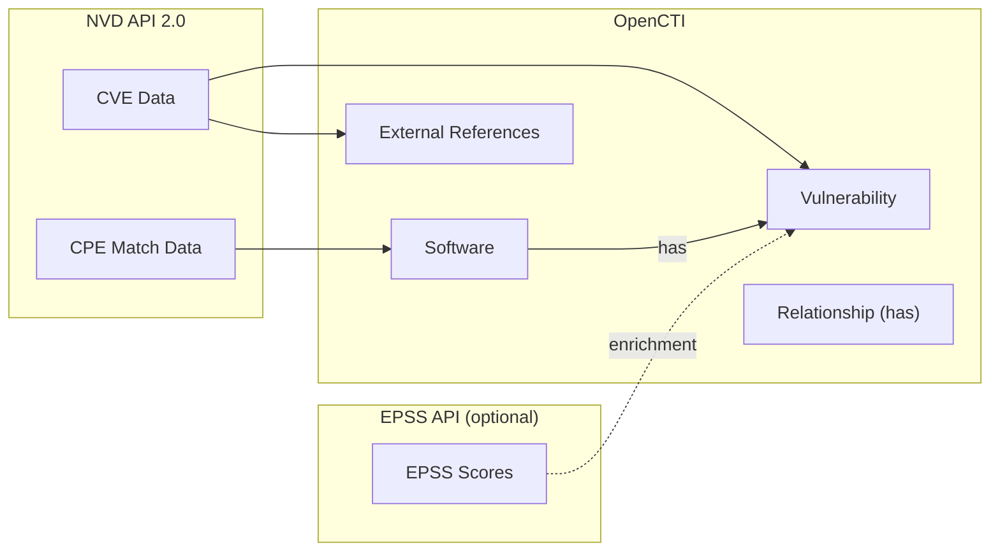

# OpenCTI NVD CVE Connector

| Status | Date | Comment |
|--------|------|---------|
| Custom | -    | CVE + CPE + Relationship + EPSS |

This connector syncs Common Vulnerabilities and Exposures (CVE) data from the NIST National Vulnerability Database (NVD) into OpenCTI, including:

- **Vulnerability** entities with full CVSS v2 / v3.1 / v4.0 scoring
- **Software** entities derived from CPE match data
- **`has` relationships** linking Software → Vulnerability
- **EPSS enrichment** (optional) from api.first.org

## Table of Contents

- [Introduction](#introduction)
- [Installation](#installation)
- [Configuration variables](#configuration-variables)
- [Deployment](#deployment)
- [Usage](#usage)
- [Behavior](#behavior)
- [Debugging](#debugging)
- [Additional information](#additional-information)

## Introduction

The National Vulnerability Database (NVD) is the U.S. government repository of standards-based vulnerability management data. This connector retrieves CVE data from the NVD API 2.0 and syncs it into OpenCTI as Vulnerability entities linked to Software via CPE data.

Unlike the official CVE connector (which handles CVE and CPE separately without relationships), this connector **creates the full graph**: Vulnerability ← has ← Software.

The connector supports both incremental updates (syncing data since last run) and historical import (pulling all CVEs from a specified year).

## Installation

### Requirements

- OpenCTI Platform >= 6.x
- NVD API key (strongly recommended — [request here](https://nvd.nist.gov/developers/request-an-api-key))

## Configuration variables

Configuration is set either in `config.yml` (manual) or via environment variables (Docker).

### OpenCTI environment variables

| Parameter     | config.yml        | Docker environment variable | Mandatory | Description                          |
|---------------|-------------------|-----------------------------|-----------|--------------------------------------|
| OpenCTI URL   | `opencti.url`     | `OPENCTI_URL`               | Yes       | The URL of the OpenCTI platform.     |
| OpenCTI Token | `opencti.token`   | `OPENCTI_TOKEN`             | Yes       | The default admin token.             |

### Connector environment variables

| Parameter         | config.yml                  | Docker environment variable     | Default  | Mandatory | Description                                                |
|-------------------|-----------------------------|---------------------------------|----------|-----------|------------------------------------------------------------|
| Connector ID      | `connector.id`              | `CONNECTOR_ID`                  |          | Yes       | A unique `UUIDv4` for this connector instance.             |
| Connector Name    | `connector.name`            | `CONNECTOR_NAME`                | NVD CVE  | No        | Display name in OpenCTI.                                   |
| Connector Scope   | `connector.scope`           | `CONNECTOR_SCOPE`               | cve      | No        | Scope of data the connector syncs.                         |
| Log Level         | `connector.log_level`       | `CONNECTOR_LOG_LEVEL`           | info     | No        | Verbosity: `debug`, `info`, `warn`, `error`.               |
| Duration Period   | `connector.duration_period` | `CONNECTOR_DURATION_PERIOD`     | PT6H     | No        | ISO 8601 interval between sync cycles.                     |

### NVD API environment variables

| Parameter          | config.yml                 | Docker environment variable   | Default                                                | Mandatory | Description                                                            |
|--------------------|----------------------------|-------------------------------|--------------------------------------------------------|-----------|------------------------------------------------------------------------|
| API Key            | `nvd.api_key`              | `NVD_API_KEY`                 | *(built-in)*                                           | No*       | NVD API key. *Without key: 5 req/30s; with key: 50 req/30s.           |
| Base URL           | `nvd.base_url`             | `NVD_BASE_URL`                | https://services.nvd.nist.gov/rest/json/cves/2.0      | No        | NVD API 2.0 endpoint.                                                  |
| Request Timeout    | `nvd.request_timeout`      | `NVD_REQUEST_TIMEOUT`         | 30                                                     | No        | Per-request timeout in seconds.                                        |
| Max Date Range     | `nvd.max_date_range`       | `NVD_MAX_DATE_RANGE`          | 120                                                    | No        | Maximum days per API query (NVD limit: 120 days).                      |
| Maintain Data      | `nvd.maintain_data`        | `NVD_MAINTAIN_DATA`           | true                                                   | No        | Incremental mode: sync CVEs modified since last run.                   |
| Pull History       | `nvd.pull_history`         | `NVD_PULL_HISTORY`            | false                                                  | No        | Historical mode: pull all CVEs from `history_start_year`.              |
| History Start Year | `nvd.history_start_year`   | `NVD_HISTORY_START_YEAR`      | 2019                                                   | No        | Start year for historical import (min 1999; CVSS v3.1 from 2019). |

### EPSS enrichment environment variables

The FIRST EPSS API has a public rate limit of **1000 requests/minute** (no authentication required).

| Parameter         | config.yml              | Docker environment variable | Default                                    | Mandatory | Description                                                       |
|-------------------|-------------------------|-----------------------------|--------------------------------------------|-----------|-------------------------------------------------------------------|
| Enabled           | `epss.enabled`          | `EPSS_ENABLED`              | true                                       | No        | Enable EPSS score enrichment.                                     |
| API URL           | `epss.api_url`          | `EPSS_API_URL`              | https://api.first.org/data/v1/epss         | No        | EPSS API endpoint (or local mirror).                              |
| Request Timeout   | `epss.request_timeout`  | `EPSS_REQUEST_TIMEOUT`      | 30                                         | No        | Per-request timeout in seconds.                                   |
| Request Delay     | `epss.request_delay`    | `EPSS_REQUEST_DELAY`        | 0.1                                        | No        | Delay between batch requests (seconds). 0.1s ≈ max 600 req/min.  |
| Batch Size        | `epss.batch_size`       | `EPSS_BATCH_SIZE`           | 30                                         | No        | CVEs per batch request (max 100).                                 |

## Deployment

### Docker Deployment

```bash
docker compose up -d
```

### Manual Deployment

1. Copy `config.yml.sample` to `config.yml` and fill in values.

2. Install dependencies:

```bash
pip3 install -r requirements.txt
```

3. Start the connector from the `src` directory:

```bash
cd src
python3 __main__.py
```

## Usage

The connector runs automatically at the interval defined by `CONNECTOR_DURATION_PERIOD` (default: every 6 hours).

To force an immediate run:

**Data Management → Ingestion → Connectors** → find the connector → click the refresh button to reset state and trigger a new sync.

## Behavior

The connector fetches CVE data from the NVD API 2.0 and converts it to STIX2 objects: Vulnerability, Software, and Relationship.

### Data Flow



### Entity Mapping

| NVD CVE Data                          | OpenCTI Entity / Property                                   | Description                          |
|---------------------------------------|-------------------------------------------------------------|--------------------------------------|
| CVE ID                                | `Vulnerability.name`                                        | CVE identifier (e.g., CVE-2021-44228)|
| Description                           | `Vulnerability.description`                                 | CVE description (English)            |
| Published Date                        | `Vulnerability.created`                                     | Date CVE was published               |
| Last Modified                         | `Vulnerability.modified`                                    | Last modification date               |
| Best CVSS baseScore                   | `Vulnerability.x_opencti_score`                             | 0-100 score (CVSS×10, v4>v3.1>v2)    |
| CWE IDs                               | `Vulnerability.x_opencti_cwe`                               | Weakness classifications             |
| References                            | External References                                         | Links to advisories and patches      |
| **CVSS v2**                           |                                                             |                                      |
| vectorString                          | `Vulnerability.x_opencti_cvss_v2_vector_string`             | CVSS v2 Vector String                |
| baseScore                             | `Vulnerability.x_opencti_cvss_v2_base_score`                | CVSS v2 Base Score                   |
| accessVector                          | `Vulnerability.x_opencti_cvss_v2_access_vector`             | CVSS v2 Access Vector                |
| accessComplexity                      | `Vulnerability.x_opencti_cvss_v2_access_complexity`         | CVSS v2 Access Complexity            |
| authentication                        | `Vulnerability.x_opencti_cvss_v2_authentication`            | CVSS v2 Authentication               |
| confidentialityImpact                 | `Vulnerability.x_opencti_cvss_v2_confidentiality_impact`    | CVSS v2 Confidentiality Impact       |
| integrityImpact                       | `Vulnerability.x_opencti_cvss_v2_integrity_impact`          | CVSS v2 Integrity Impact             |
| availabilityImpact                    | `Vulnerability.x_opencti_cvss_v2_availability_impact`       | CVSS v2 Availability Impact          |
| **CVSS v3.1**                         |                                                             |                                      |
| vectorString                          | `Vulnerability.x_opencti_cvss_vector_string`                | CVSS v3.1 Vector String              |
| baseScore                             | `Vulnerability.x_opencti_cvss_base_score`                   | CVSS v3.1 Base Score                 |
| baseSeverity                          | `Vulnerability.x_opencti_cvss_base_severity`                | CRITICAL / HIGH / MEDIUM / LOW       |
| attackVector                          | `Vulnerability.x_opencti_cvss_attack_vector`                | CVSS v3.1 Attack Vector              |
| attackComplexity                      | `Vulnerability.x_opencti_cvss_attack_complexity`            | CVSS v3.1 Attack Complexity          |
| privilegesRequired                    | `Vulnerability.x_opencti_cvss_privileges_required`          | CVSS v3.1 Privileges Required        |
| userInteraction                       | `Vulnerability.x_opencti_cvss_user_interaction`             | CVSS v3.1 User Interaction           |
| scope                                 | `Vulnerability.x_opencti_cvss_scope`                        | CVSS v3.1 Scope                      |
| confidentialityImpact                 | `Vulnerability.x_opencti_cvss_confidentiality_impact`       | CVSS v3.1 Confidentiality Impact     |
| integrityImpact                       | `Vulnerability.x_opencti_cvss_integrity_impact`             | CVSS v3.1 Integrity Impact           |
| availabilityImpact                    | `Vulnerability.x_opencti_cvss_availability_impact`          | CVSS v3.1 Availability Impact        |
| **CVSS v4.0**                         |                                                             |                                      |
| vectorString                          | `Vulnerability.x_opencti_cvss_v4_vector_string`             | CVSS v4.0 Vector String (sanitized)  |
| baseScore                             | `Vulnerability.x_opencti_cvss_v4_base_score`                | CVSS v4.0 Base Score                 |
| baseSeverity                          | `Vulnerability.x_opencti_cvss_v4_base_severity`             | CVSS v4.0 Base Severity              |
| attackVector                          | `Vulnerability.x_opencti_cvss_v4_attack_vector`             | CVSS v4.0 Attack Vector (AV)         |
| attackComplexity                      | `Vulnerability.x_opencti_cvss_v4_attack_complexity`         | CVSS v4.0 Attack Complexity (AC)     |
| attackRequirements                    | `Vulnerability.x_opencti_cvss_v4_attack_requirements`       | CVSS v4.0 Attack Requirements (AT)   |
| privilegesRequired                    | `Vulnerability.x_opencti_cvss_v4_privileges_required`       | CVSS v4.0 Privileges Required (PR)   |
| userInteraction                       | `Vulnerability.x_opencti_cvss_v4_user_interaction`          | CVSS v4.0 User Interaction (UI)      |
| vulnConfidentialityImpact             | `Vulnerability.x_opencti_cvss_v4_confidentiality_impact_v`  | CVSS v4.0 Confidentiality (VC)       |
| subConfidentialityImpact              | `Vulnerability.x_opencti_cvss_v4_confidentiality_impact_s`  | CVSS v4.0 Confidentiality (SC)       |
| vulnIntegrityImpact                   | `Vulnerability.x_opencti_cvss_v4_integrity_impact_v`        | CVSS v4.0 Integrity (VI)             |
| subIntegrityImpact                    | `Vulnerability.x_opencti_cvss_v4_integrity_impact_s`        | CVSS v4.0 Integrity (SI)             |
| vulnAvailabilityImpact                | `Vulnerability.x_opencti_cvss_v4_availability_impact_v`     | CVSS v4.0 Availability (VA)          |
| subAvailabilityImpact                 | `Vulnerability.x_opencti_cvss_v4_availability_impact_s`     | CVSS v4.0 Availability (SA)          |
| exploitMaturity                       | `Vulnerability.x_opencti_cvss_v4_exploit_maturity`          | CVSS v4.0 Exploit Maturity (E)       |
| **EPSS** (optional)                   |                                                             |                                      |
| epss                                  | `Vulnerability.x_opencti_epss_score`                        | EPSS Score (float)                   |
| percentile                            | `Vulnerability.x_opencti_epss_percentile`                   | EPSS Percentile (float)              |
| **CPE**                               |                                                             |                                      |
| CPE 2.3 criteria                      | `Software.cpe`                                              | Full CPE string                      |
| vendor                                | `Software.vendor`                                           | Software vendor                      |
| product                               | `Software.name`                                             | Software name                        |
| version                               | `Software.version`                                          | Software version                     |
| **Relationship**                      |                                                             |                                      |
| CPE match → CVE                       | `Relationship (has)` Software → Vulnerability               | Software has vulnerability           |

### Operating Modes

1. **Incremental Updates** (`maintain_data=true`, default):
   - Syncs CVEs modified since the last run
   - On first run, imports CVEs modified in the last 24 hours
   - Keeps vulnerability data up-to-date

2. **Historical Import** (`pull_history=true`):
   - Imports all CVEs from `history_start_year` to present
   - Saves progress — resumes from where it stopped on failure
   - Useful for initial population of the database
   - Minimum start year: 1999 (CVSS v3.1 starts at 2019)

### Processing Details

- **CVSS Support**: Full CVSS v2, v3.1, and v4.0 field mapping
- **CVSS v4.0 Vector Sanitization**: NVD vectors contain supplemental/environmental metrics that OpenCTI doesn't accept; the connector strips them automatically
- **Rate Limiting**: With API key: 50 requests/30 seconds (~0.6s delay). Without API key: 5 requests/30 seconds (~6s delay). Automatic retry on 403/503.
- **Pagination**: NVD API returns max 2000 results per page; connector paginates automatically
- **Date Range Windowing**: Large ranges are split into ≤120-day windows per NVD requirements
- **EPSS Enrichment**: Batched queries (up to 100 CVEs per request) to minimize API calls
- **Upsert**: All data is synced via upsert — existing entities are updated, new ones are created

## Debugging

Enable verbose logging:

```yaml
connector:
  log_level: debug
```

Or via environment variable:

```env
CONNECTOR_LOG_LEVEL=debug
```

## Additional information

- **API Key**: Strongly recommended for reasonable rate limits. Request at [NVD](https://nvd.nist.gov/developers/request-an-api-key)
- **Rate Limits**: With API key: 50 requests/30 seconds. Without: 5 requests/30 seconds (heavily throttled)
- **CVSS v3.1**: Available from 2019 onward (release year)
- **Large Dataset**: NVD contains 200,000+ CVEs; historical import takes significant time
- **Polling Interval**: NIST recommends minimum 2-hour intervals
- **EPSS**: Scores update daily; enable with `EPSS_ENABLED=true`
- **Reference**: [NVD API Documentation](https://nvd.nist.gov/developers/vulnerabilities)